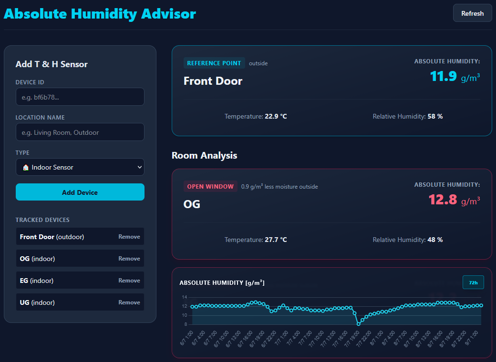

# Absolute Humidity Advisor

A web UI for Tuya Temperature & Humidity Sensors to advise you about when to ventilate based on absolute humidity.



## Quick start

- Create a `.env` file (fill in `$placeholders` with your values):

```bash
TUYA_CLIENT_ID=$yourTuyaClientId
TUYA_SECRET=$yourTuyaSecret
TUYA_ENDPOINT=$yourTuyaEndpoint
PORT=$choosePort
NTFY_TOPIC=$chooseNtfyTopic
NTFY_DIFF_THRESHOLD=0.3
```

- Setup `Node.js` and its package manager `npm`.

- Install dependencies (open terminal in your project folder):

```bash
npm install
```

- Start the server:

```bash
node server.js
```

- Open the web UI with the link shown in terminal.

- For push notifications to your smartphone:\
Download the `ntfy` app and subscribe to `$chooseNtfyTopic`.
